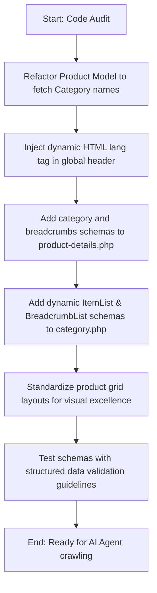

# Generative Engine Optimization (GEO) Audit & Implementation Plan
## Project: Sabaya Luxury — Luxury Abaya E-Commerce Platform

---

## 1. GEO Audit Report
Generative Engine Optimization (GEO) focuses on optimizing content and structures to ensure that Generative AI models (e.g., Gemini, ChatGPT, Claude, Perplexity, and Copilot) can easily find, parse, summarize, and recommend products or pages.

Generative AI search engines rely on semantic understanding. Instead of just looking for keywords, they analyze:
1. **Semantic HTML5 structures** to determine the hierarchical importance of content.
2. **JSON-LD Schema.org markup** to extract structured, relational data fields (e.g., price, stock status, product characteristics, and page hierarchies).
3. **Structured text** without keyword stuffing or deceptive local targeting, focusing instead on high-quality descriptions.

### How Our Modifications Help AI Engines:
* **Rich Product Schema Integration:** AI search assistants answering queries like "Where can I find black luxury abayas?" or "What size options do Sabaya abayas have?" can extract sizes (`size`), colors (`color`), category (`category`), unique identifier (`sku`), availability (`availability`), and currency (`priceCurrency`) without needing to infer them from raw HTML.
* **BreadcrumbList Schemas:** Generates clean traversal paths (`Accueil > Catégorie > Produit`) that help engines understand how products map to collections.
* **ItemList (Product Listings):** Tells generative models exactly how many items are present in a category page and allows direct navigation parsing for each item card.
* **Dynamic HTML Lang Attribute:** Assists NLP models in switching parser tokenizers between French and English.
* **Semantic HTML H2 Headings:** Adds explicit structural divisions (e.g., "Description" and "Details & Coupe") allowing AI models to retrieve specific blocks of information for precise snippets.

---

## 2. Gap Analysis (What was missing and why we chose to add it)

| Page / Component | Missing Elements | Impact on GEO / AI Readability | Resolution / Choice |
| :--- | :--- | :--- | :--- |
| **Global Header (`header.php`)** | Hardcoded `<html lang="fr">` | AI NLP models could struggle with translation boundaries when English is active. | Replaced with dynamic `$activeLang` setting. |
| **Product Model (`Product.php`)** | JOIN query for category names | Missing context on category mappings on product details. | Refactored `find($id)` using a `LEFT JOIN` on `categorie`. |
| **Product Details (`product-details.php`)** | Breadcrumb schema and rich product fields (`sku`, `category`, `itemCondition`). | AI search results cannot build accurate listings or verify condition. | Appended complete `BreadcrumbList` schema and enriched `Product` schema with key marketplace properties. |
| **Product Details UI (`product-details.php`)** | Semantic `<h2>` headings for description and specifications. | Section separation was implicit rather than explicit. | Added an accessible `h2` description label and a structured `h2` details header. |
| **Category Page (`category.php`)** | Structured schemas (`ItemList` and `BreadcrumbList`) and grid structure. | Page was invisible as a "List" to AI; visual layout was basic/unstyled compared to standard products page. | Integrated dynamic `ItemList` and `BreadcrumbList` JSON-LD schemas, and refactored the UI grid to match the premium `.products-grid` layout. |

---

## 3. Files Modified

1. **`models/Product.php`**
   * Refactored `find($id)` to include category names.
2. **`lang/fr.php` & `lang/en.php`**
   * Registered `product_specs_heading` for multilingual UI headers.
3. **`includes/header.php`**
   * Set dynamic `<html lang="...">` parameter.
4. **`products/product-details.php`**
   * Implemented enriched `Product` and `BreadcrumbList` schemas.
   * Restructured HTML breadcrumbs and added semantic `h2` sections.
5. **`products/category.php`**
   * Implemented category-specific `ItemList` and `BreadcrumbList` schemas.
   * Ported premium grid UI layout for consistent visual aesthetics and accessibility.

---

## 4. JSON-LD Code Reference

### A. Dynamic BreadcrumbList Schema (`product-details.php`)
```json
{
    "@context": "https://schema.org",
    "@type": "BreadcrumbList",
    "itemListElement": [
        {
            "@type": "ListItem",
            "position": 1,
            "name": "Accueil",
            "item": "https://sabaya.ma/index.php"
        },
        {
            "@type": "ListItem",
            "position": 2,
            "name": "Luxury Abayas",
            "item": "https://sabaya.ma/products/category.php?id=3"
        },
        {
            "@type": "ListItem",
            "position": 3,
            "name": "Abaya Noir Soie",
            "item": "https://sabaya.ma/products/product-details.php?id=12"
        }
    ]
}
```

### B. Enriched Product Schema
```json
{
    "@context": "https://schema.org",
    "@type": "Product",
    "name": "Abaya Noir Soie",
    "description": "Une abaya en soie de haute qualité pour toutes vos occasions spéciales.",
    "image": "https://sabaya.ma/assets/images/products/abaya-noir.jpg",
    "sku": "SAB-12",
    "mpn": "SAB-12",
    "category": "Luxury Abayas",
    "brand": {
        "@type": "Brand",
        "name": "Sabaya Luxury"
    },
    "offers": {
        "@type": "Offer",
        "url": "https://sabaya.ma/products/product-details.php?id=12",
        "priceCurrency": "MAD",
        "price": "1200",
        "priceValidUntil": "2027-12-31",
        "itemCondition": "https://schema.org/NewCondition",
        "availability": "https://schema.org/InStock",
        "seller": {
            "@type": "Organization",
            "name": "Sabaya Luxury",
            "url": "https://sabaya.ma"
        }
    },
    "color": "Noir",
    "size": "M"
}
```

### C. ItemList Schema (`category.php`)
```json
{
    "@context": "https://schema.org",
    "@type": "ItemList",
    "name": "Catégorie Premium — Sabaya Luxury",
    "description": "Découvrez notre collection d'abayas dans la catégorie Premium.",
    "numberOfItems": 3,
    "itemListElement": [
        {
            "@type": "ListItem",
            "position": 1,
            "url": "https://sabaya.ma/products/product-details.php?id=1",
            "name": "Abaya Perles"
        },
        {
            "@type": "ListItem",
            "position": 2,
            "url": "https://sabaya.ma/products/product-details.php?id=2",
            "name": "Abaya Dentelle"
        }
    ]
}
```

---

## 5. Semantic HTML Improvements

1. **Hierarchy and Navigation Structure:**
   * Replaced generic collection-to-product links with a direct breadcrumb trail using `<nav aria-label="Fil d'Ariane">`.
   * Enforced single H1 per page for both dynamic details and collection headers.
2. **Explicit Sectioning:**
   * Embedded description and specifications within `<h2 class="sr-only">` and `<h2 class="pd-specs-title">` labels.
   * Utilized the `<article class="product-card">` layout in `category.php` to define self-contained items.

---

## 6. Implementation Workflow


